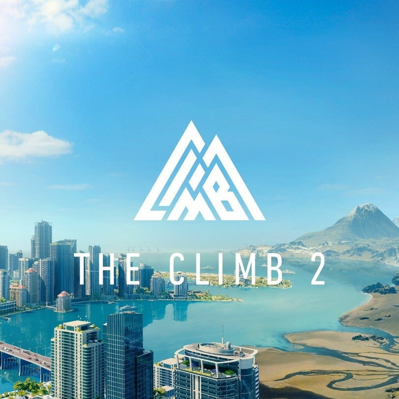

# Existing Products

## 1. The Climb 2 - Crytek

https://www.theclimbgame.com/

### Features

#### Stamina-based climbing
- Gripping a hold with a single hand, reduces the stamina of that hand.
- Gripping with 2 hands restores stamina in both hands
- Increase Total Stamina by chalking hands -> Hold a trigger and twist
- Chalk reduces each time a grip is held

#### Grip Positions
- Half Grip maintains stamina -> Controlled by "half pressing"
- "sharp" grips bloodies the screen and quickly reduces stamina - weird?

#### Asynchronous Multiplayer
- Creates a "ghost" of your friends to race against

#### Dynamic Physics-Based Interactive Environments
- Objects to climb can move around based on your movement. 
- Basic Rope swing physics

#### Variety of Modes and Customization
- Casual Mode - Lets you climbing without any stamina limitations
- Proffesional Mode - All stamina Requirements
